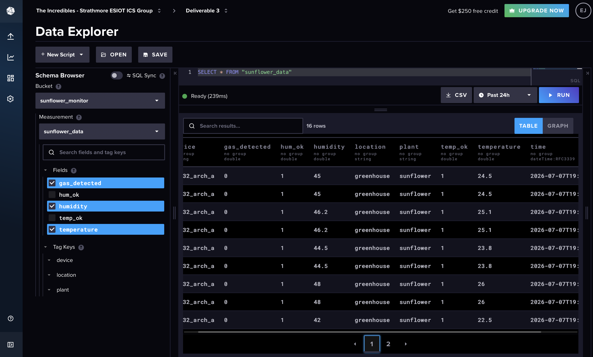
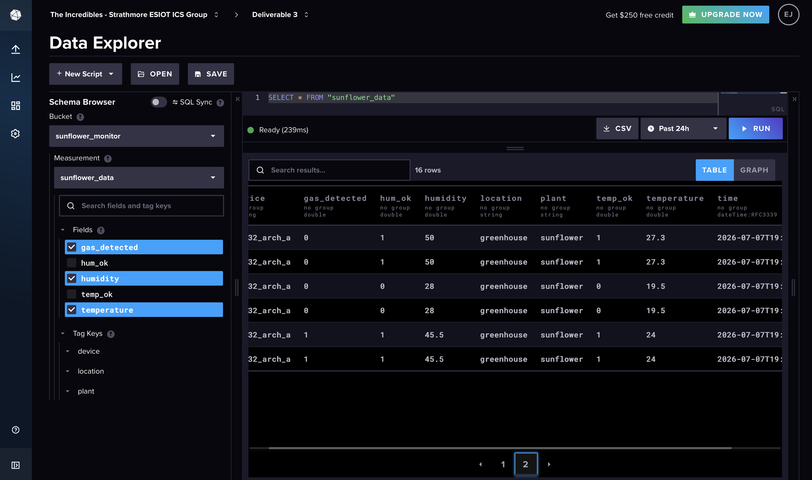

# ICS 4111: Embedded Systems & IoT
## Semester Project — Deliverable 3
### Transmit and Visualise Sensor Data on Cloud Platforms

---

**Group 3: The Incredibles**

| # | Name | Reg. No. |
|---|---|---|
| 1 | Tavasi Wyclef Wasike | 166082 |
| 2 | Esther Jesicah Wanjiku | 166232 |
| 3 | Patel Radha Shaileshkumar | 149226 |
| 4 | Odhiambo Eugene Onyango | 166333 |
| 5 | Wafula Mornylyne Mutilah | 164534 |
| 6 | Isiaho Zahra Wambui | 169652 |

---

## Objective

To transmit sensor data from an ESP32-based embedded system to cloud platforms (InfluxDB and Grafana) for time-series storage and visualisation, monitoring environmental conditions suitable for sunflower growth.

---

## 1. Device Architecture

This deliverable uses **Architecture A**: a single ESP32 connected to one MQ-5 gas sensor, one DHT22 temperature and humidity sensor, and one 16×2 I²C LCD display.

The ESP32 reads sensor data locally, displays it on the LCD, and transmits it over Wi-Fi to InfluxDB for cloud storage. Grafana queries InfluxDB to produce a live monitoring dashboard.

### Data Flow

```
DHT22 (Temp + Humidity)  ──┐
                            ├──→ ESP32 S ──→ LCD (local display)
MQ-5  (Gas detection)    ──┘        │
                                     │ Wi-Fi
                                     ↓
                               InfluxDB Cloud
                            (time-series database)
                                     │
                                     ↓
                              Grafana Dashboard
                           (3+ visualisations)
```

### Pin Assignments

| ESP32 Pin | Board Label | Connected To | Notes |
|---|---|---|---|
| GPIO4 | D4 | DHT22 DATA | 10 kΩ pull-up to 3.3 V |
| GPIO2 | D2 | MQ-5 DOUT | Digital output, 3.3 V safe |
| GPIO21 | D21 | LCD SDA | I²C data |
| GPIO22 | D22 | LCD SCL | I²C clock |
| 3V3 | 3V3 | DHT22 VCC, LCD VCC | 3.3 V power |
| VIN | VIN | MQ-5 VCC | 5 V power |
| GND | GND | All module grounds | Common ground |

---

## 2. Prototype

### Wokwi Simulation

> **Simulation Link:** [https://wokwi.com/projects/468931232438993921]

The simulation replicates Architecture A using:
- `wokwi-esp32-devkit-v1` — the ESP32 microcontroller
- `wokwi-dht22` — temperature and humidity sensor (set to 24 °C, 45% RH)
- `wokwi-mq2` — gas sensor (Wokwi equivalent of MQ-5)
- `wokwi-lcd1602` — 16×2 I²C LCD display
- `wokwi-resistor` — 10 kΩ pull-up on DHT22 data line

**Screenshot of simulation running:**


**Serial monitor output:**

```
=============================
 ICS 4111 — Deliverable 3
 Group 3: The Incredibles
 Architecture A
 ESP32 + DHT22 + MQ5 + LCD
=============================
-----------------------------
Temperature : 24.0 C  [OK]
Humidity    : 45.0 %  [OK]
Gas (DOUT)  : SAFE
Sunflower   : CONDITIONS MET
-----------------------------
-- InfluxDB Write (simulated) --
sunflower_data,device=esp32_arch_a,location=greenhouse temperature=24.0,humidity=45.0,gas_detected=0
--------------------------------
```

---

## 3. Full Sketch Code

```cpp
#include <DHT.h>
#include <Wire.h>
#include <LiquidCrystal_I2C.h>
#include <WiFi.h>
#include <InfluxDbClient.h>
#include <InfluxDbCloud.h>

// ── Wi-Fi credentials ─────────────────────────────────
#define WIFI_SSID     "YOUR_WIFI_NAME"
#define WIFI_PASSWORD "YOUR_WIFI_PASSWORD"

// ── InfluxDB credentials ──────────────────────────────
#define INFLUXDB_URL    "https://eu-central-1-1.aws.cloud2.influxdata.com"
#define INFLUXDB_TOKEN  "YOUR_API_TOKEN_HERE"
#define INFLUXDB_ORG    "YOUR_ORG_NAME_HERE"
#define INFLUXDB_BUCKET "sunflower_monitor"

// ── Pin definitions ───────────────────────────────────
#define DHT_PIN   4
#define MQ5_PIN   2
#define SDA_PIN   21
#define SCL_PIN   22
#define DHT_TYPE  DHT22
#define LCD_ADDR  0x27

// ── Objects ───────────────────────────────────────────
DHT dht(DHT_PIN, DHT_TYPE);
LiquidCrystal_I2C lcd(LCD_ADDR, 16, 2);
InfluxDBClient client(INFLUXDB_URL, INFLUXDB_ORG,
                      INFLUXDB_BUCKET, INFLUXDB_TOKEN,
                      InfluxDbCloud2CACert);
Point sensor("sunflower_data");

void setup() {
  Serial.begin(115200);
  pinMode(MQ5_PIN, INPUT);

  Wire.begin(SDA_PIN, SCL_PIN);
  lcd.init();
  lcd.backlight();
  lcd.setCursor(0, 0);
  lcd.print("Sunflower IoT");
  lcd.setCursor(0, 1);
  lcd.print("Connecting WiFi");

  dht.begin();

  WiFi.begin(WIFI_SSID, WIFI_PASSWORD);
  while (WiFi.status() != WL_CONNECTED) {
    delay(500);
    Serial.print(".");
  }
  Serial.printf("\nWiFi connected. IP: %s\n",
                 WiFi.localIP().toString().c_str());

  lcd.clear();
  lcd.setCursor(0, 0);
  lcd.print("WiFi Connected!");
  lcd.setCursor(0, 1);
  lcd.print(WiFi.localIP().toString());
  delay(2000);

  timeSync("EAT-3", "pool.ntp.org", "time.nis.gov");

  if (client.validateConnection()) {
    Serial.printf("InfluxDB connected: %s\n",
                   client.getServerUrl().c_str());
  } else {
    Serial.printf("InfluxDB failed: %s\n",
                   client.getLastErrorMessage().c_str());
  }

  sensor.addTag("device",   "esp32_arch_a");
  sensor.addTag("location", "greenhouse");
  sensor.addTag("plant",    "sunflower");

  lcd.clear();
}

void loop() {
  float temp = dht.readTemperature();
  float hum  = dht.readHumidity();
  int   gas  = digitalRead(MQ5_PIN);

  if (isnan(temp) || isnan(hum)) {
    Serial.println("DHT read failed");
    delay(2000);
    return;
  }

  String tStatus = (temp >= 20 && temp <= 28) ? "OK"   : "WARN";
  String hStatus = (hum  >= 30 && hum  <= 50) ? "OK"   : "WARN";
  String gStatus = (gas != 0)                  ? "SAFE" : "GAS!";

  Serial.printf("Temp: %.1fC [%s]  Hum: %.1f%% [%s]  Gas: %s\n",
                 temp, tStatus.c_str(), hum, hStatus.c_str(),
                 gStatus.c_str());

  lcd.setCursor(0, 0);
  lcd.print("T:");
  lcd.print(temp, 1);
  lcd.print("C H:");
  lcd.print((int)hum);
  lcd.print("%   ");

  lcd.setCursor(0, 1);
  lcd.print("Gas:");
  lcd.print(gStatus);
  lcd.print(" T:");
  lcd.print(tStatus);
  lcd.print(" H:");
  lcd.print(hStatus);

  sensor.clearFields();
  sensor.addField("temperature",  temp);
  sensor.addField("humidity",     hum);
  sensor.addField("gas_detected", gas == 0 ? 1 : 0);
  sensor.addField("temp_ok",      temp >= 20 && temp <= 28 ? 1 : 0);
  sensor.addField("hum_ok",       hum  >= 30 && hum  <= 50 ? 1 : 0);

  if (!client.writePoint(sensor)) {
    Serial.printf("Write failed: %s\n",
                   client.getLastErrorMessage().c_str());
  } else {
    Serial.println("Data written to InfluxDB");
  }

  delay(10000);
}
```

### Libraries Required

| Library | Author | Purpose |
|---|---|---|
| DHT sensor library | Adafruit | Reads DHT22 temperature and humidity |
| LiquidCrystal I2C | Frank de Brabander | Drives 16×2 I²C LCD |
| InfluxDB Client for Arduino | Tobias Schürg | Sends data to InfluxDB Cloud |

---

## 4. Cloud Storage — InfluxDB

InfluxDB Cloud was used as the time-series database to store all sensor readings from the ESP32.

### Configuration

| Parameter | Value |
|---|---|
| Platform | InfluxDB Cloud (Free tier) |
| Bucket | `sunflower_monitor` |
| Measurement | `sunflower_data` |
| Retention | 30 days |
| Region | EU West |

### Fields Stored

| Field | Type | Description |
|---|---|---|
| `temperature` | float | Air temperature in °C from DHT22 |
| `humidity` | float | Relative humidity in % from DHT22 |
| `gas_detected` | integer | 1 = gas detected, 0 = safe |
| `temp_ok` | integer | 1 = within sunflower range (20–28 °C) |
| `hum_ok` | integer | 1 = within sunflower range (30–50%) |

### Tags

| Tag | Value | Purpose |
|---|---|---|
| `device` | esp32_arch_a | Identifies the sending device |
| `location` | greenhouse | Physical location |
| `plant` | sunflower | Crop being monitored |

### InfluxDB Data Explorer Screenshot





### Flux Query Used

```flux
from(bucket: "sunflower_monitor")
  |> range(start: -1h)
  |> filter(fn: (r) => r._measurement == "sunflower_data")
  |> filter(fn: (r) => r._field == "temperature")
```

---

## 5. Visualisation — Grafana Dashboard

Grafana Cloud was connected to InfluxDB as a data source and used to create a live monitoring dashboard with four visualisations.

### Dashboard Link

> **Public Dashboard:** [https://smallcat1191.grafana.net/d/esdpt55/deliverable-3-data-visualisation?orgId=1&from=now-24h&to=now&timezone=browser]

### Visualisation 1 — Temperature Over Time

- **Type:** Time series line graph
- **Field:** `temperature`
- **Purpose:** Tracks air temperature trends over time
- **Thresholds:** Alert bands at 20 °C (lower) and 28 °C (upper) — the optimal sunflower range

**Flux Query:**
```flux
from(bucket: "sunflower_monitor")
  |> range(start: -1h)
  |> filter(fn: (r) => r._measurement == "sunflower_data")
  |> filter(fn: (r) => r._field == "temperature")
```


---

### Visualisation 2 — Humidity Over Time

- **Type:** Time series line graph
- **Field:** `humidity`
- **Purpose:** Tracks relative humidity trends over time
- **Thresholds:** Alert bands at 30% (lower) and 50% (upper) — the optimal sunflower range

**Flux Query:**
```flux
from(bucket: "sunflower_monitor")
  |> range(start: -1h)
  |> filter(fn: (r) => r._measurement == "sunflower_data")
  |> filter(fn: (r) => r._field == "humidity")
```


---

### Visualisation 3 — Gas Detection Status

- **Type:** State timeline
- **Field:** `gas_detected`
- **Purpose:** Shows when combustible gas was detected vs safe periods
- **States:** 0 = Safe (green), 1 = Gas Detected (red)

**Flux Query:**
```flux
from(bucket: "sunflower_monitor")
  |> range(start: -1h)
  |> filter(fn: (r) => r._measurement == "sunflower_data")
  |> filter(fn: (r) => r._field == "gas_detected")
```


---

### Visualisation 4 — Current Readings (Stat Panels)

- **Type:** Stat (current value display)
- **Fields:** `temperature`, `humidity`
- **Purpose:** Shows the most recent sensor readings at a glance

**Flux Query:**
```flux
from(bucket: "sunflower_monitor")
  |> range(start: -5m)
  |> filter(fn: (r) => r._measurement == "sunflower_data")
  |> filter(fn: (r) => r._field == "temperature" or r._field == "humidity")
  |> last()
```


---

### Full Dashboard Screenshot


---

## 6. Sunflower Monitoring Logic

The system monitors three parameters against the optimal ranges established in Deliverable 1:

| Parameter | Optimal Range | Sensor | Alert Condition |
|---|---|---|---|
| Temperature | 20 °C – 28 °C | DHT22 | Outside range → LCD shows WARN |
| Relative Humidity | 30% – 50% | DHT22 | Outside range → LCD shows WARN |
| Combustible Gas | None detected | MQ-5 | Detected → LCD shows GAS! |

Data is sent to InfluxDB every **10 seconds** and the LCD updates every **3 seconds**.

---

## 7. Evidence of Group Work

> [INSERT GROUP PHOTO HERE]

| Task | Member |
|---|---|
| Wokwi simulation setup | |
| InfluxDB cloud configuration | |
| Grafana dashboard creation | |
| Arduino code development | |
| Markdown documentation | |
| Circuit wiring | |

---

## 8. References

| Resource | Link |
|---|---|
| InfluxDB Cloud | https://cloud2.influxdata.com |
| Grafana Cloud | https://grafana.com |
| InfluxDB Arduino Client | https://github.com/tobiasschuerg/InfluxDB-Client-for-Arduino |
| DHT22 Datasheet | https://cdn-shop.adafruit.com/datasheets/Digital+humidity+and+temperature+sensor+AM2302.pdf |
| MQ-5 Datasheet | https://www.pololu.com/file/0J309/MQ5.pdf |
| ESP32 DevKit Datasheet | https://www.espressif.com/sites/default/files/documentation/esp32-wroom-32_datasheet_en.pdf |
| Wokwi Simulator | https://wokwi.com |
